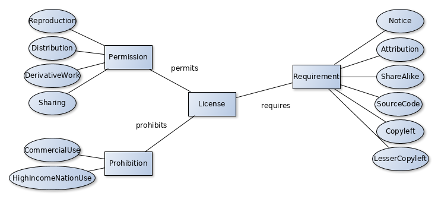
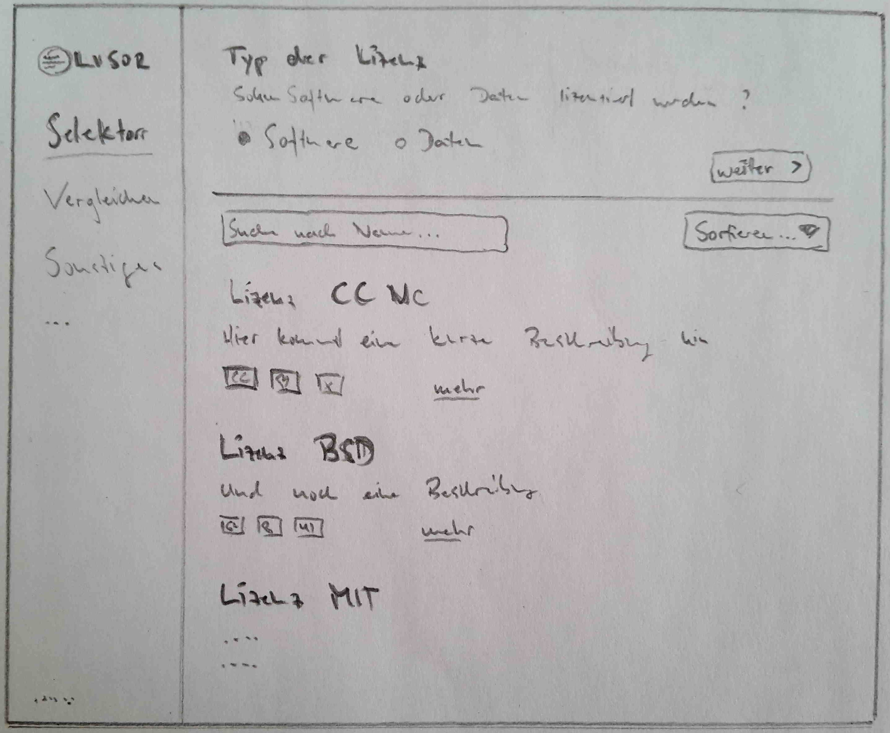
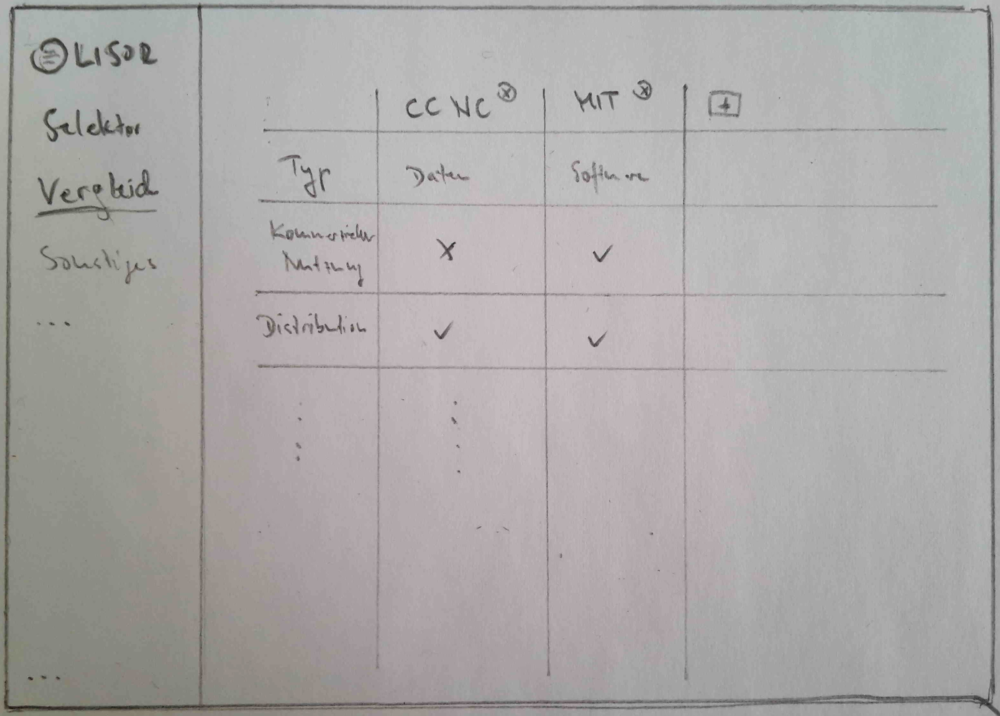
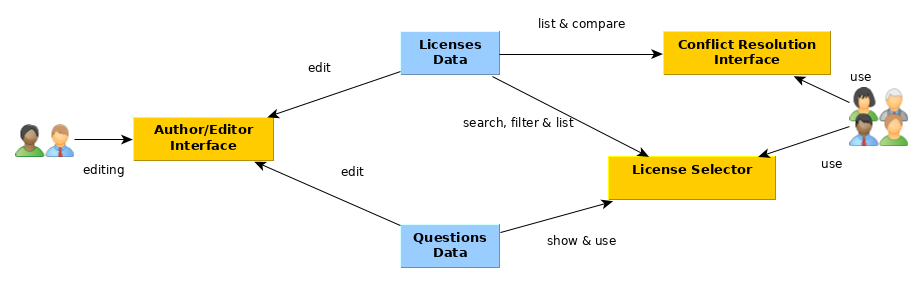

# Webapplikation für die Selektion und Konfliktresolution von Lizenz-Ontologien

## Inhalt

- [Aufgaben](#Aufgaben)
- [Einleitung](#Einleitung)
- [Existierende Lösungen](#Existierende&nbsp;Lösungen)
- [Grundlagen: Lizenzen](#Grundlagen:&nbsp;Lizenzen)
    - ccREL
    - ODRL
    - DALIcc
- [Aufbau der Applikation](#Aufbau&nbsp;der&nbsp;Applikation)
    - Mockups
    - Lizenz-Selektor
    - Konfliktresolution
    - Editor


## Aufgaben

1. Entwicklung eines Konzeptes zur Lizenzverwaltung integrierter und veredelter Daten mit integriertem Selektionsprozess
2. Aufbau und Integration einer Lizenz-Ontologie für Daten
3. Entwicklung einer Lizenz-Konfliktresolution

## Einleitung

Veröffentlichte Daten oder Software ohne eine zugehörige Lizenz sind nicht verwendbar, da die rechtliche Situation unklar ist. Für Projekte (oder Daten) die wiederverwendet werden sollen muss daher eine passende, im Sinne des Eigentümers/Herstellers, Lizenz gewählt werden.

Die Auswahl einer passenden Lizenz gestaltet sich als nicht einfach, da viele öffentliche Lizenzen existieren und die Unterschiede teilweise erst bei genauem durchlesen der Lizenzen klar wird.

Erforderlich hierfür ist eine benutzerfreundliche Hilfestellung zur Auswahl einer den Anforderungen entsprechenden Lizenz in Form einer Webapplikation.

<!--Use Cases:

- Lizenzgeber besitzt Daten/Software und ist auf der Suche nach einer passenden Lizenz
- Lizenznehmer verwendet Daten/Software und will wissen was er damit machen darf, unter welchen Bedingungen, und was nicht.-->

## Existierende Lösungen

Die Webseite choosealicense.com (erstellt von GitHub) unterstützt die Auswahl mit einer einfachen Untergliederung: ob das Projekt von anderen Lizenzen abhängt, ob eine freizügige oder strenge Lizenz gewählt werden soll und ob es sich nicht um eine Software, sondern um Daten handelt.

Die Webapplikation License Selector (https://ufal.github.io/public-license-selector/) implementiert ein Formular, welches eine Liste mit Lizenzen zeigt, die anhand verschiedener Fragen nach den Suchkriterien gefiltert wird. Die Fragen sind hierarchisch gegliedert, unterscheiden in Daten und Software, eigene und freme Bibliotheken und verschiedenen Angaben zu erlaubten/eingeschränkten Attributen (Distribution, kommerzielle Nutzung).


## Grundlagen: Lizenzen

Legen fest, welche Verwendungszwecke mit einem Objekt (zB Quellcode/Software) unter welchen Bedinungen erlaubt oder verboten sind.

Lizenzgeber (teilt aus) / Lizenznehmer (verwendet), schließen Vertrag ab.

Das Ausführen von Software im privaten Bereich unterliegt keinen Lizenzbestimmungen. Erst für Kopien, Bearbeitung, Veröffentlichung usw. sind Verwertungs-/Nutzungsrechte notwendig. (https://www.gesetze-im-internet.de/urhg/__69d.html).

Software/Quellcode ohne Angabe einer Lizenz sollte nicht verwendet werden, da die Situation unklar ist.

Zumeist sind Nutzungsrechte eingeteilt in:

- Erlaubnis (Can/Permission). Die Erlaubnis für etwas
- Einschränkung (Cannot/Limitation/Prohibition). Etwas ist nicht gestattet
- Bedingung (Must/Condition/Requirement). Eine Bedingung für die Verwendung


**Eigenschaften nach https://choosealicense.com/appendix/:**

- Commercial use: kommerzielle Nutzung ist gestattet
- Distribution: Weitergabe gestattet
- Modification: Veränderung gestattet
- Patent use: Lizenz eignet sich/eignet sich nicht für Patente
- Private use: Private Nutzung gestattet
- Disclose source: Wenn die Software verteilt wird, muss auch der Quelltext verfügbar gemacht werden
- License and copyright notice: Eine kopie und ein Copright Hinweis muss beigefügt sein
- Network use is distribution: Für die Verwendung der Software im Netzwerk muss die Weitergabe (Distribution) gestattet sein
. Same license: Die Software muss unter der gleichen (oder ähnlichen) Lizenz weitergegeben werden
- State changes: Codeänderungen müssen dokumentiert werden
- Liability: Expliziete limitierte Haftung
- Trademark use: Expliziter Markenschutz
- Warranty: Expliziet keine Gewährleistungsansprüche

### Creative Commons Rights Expression Language (ccREL)

https://creativecommons.org/ns und https://wiki.creativecommons.org/images/d/d6/Ccrel-1.0.pdf

Von der Creative Commons (CC) empfohlener Standard um Copyright und Lizenzinformationen in RDF auszudrücken.

Die ccREL Architektur als Diagramm:



#### Beispiel Gnu GPL V3

Erlaubt ist: Commercial Use, Distribution, Modification, Patent Use, Private Use
Bedinungen:  Disclose source, License and copyright notice, Same license, State changes
Einschränkung:  Liability, Warranty

```
@prefix cc: <http://creativecommons.org/ns#>

<http://gnu.org/licenses/gpl-3.0.html>
    a cc:License
    cc:requires cc:Copyleft
    cc:requires cc:SourceCode
    cc:requires cc:Notice
    cc:permits cc:Distribution
    cc:permits cc:Reproduction
    cc:permits cc:DerivativeWorks
```

Patent use und State changes fehlt. Außerdem Liability und Warranty (ist das überhaupt notwendig?).

### Open Digital Rights Language (ODRL)

https://www.w3.org/TR/odrl-model

Vokabular um Nutzungsrechte über Inhalte und Services auszudrücken.

#### Beispiel Gnup GPL V3

```
<http://gnu.org/licenses/gpl-3.0.html>
    a odrl:Policy ;
    odrl:permission
      [
         odrl:action odrl:distribute , odrl:modify , odrl:reproduce ;
	     odrl:duty
		 [
		    odrl:action cc:Notice , cc:ShareAlike
		 ] ;
	  ] ;
```

Weder ccREL noch ODRL sind komplett.


### Data Licenses Clearance Center (DALIcc)

https://2018.eswc-conferences.org/files/posters-demos/paper_298.pdf

1) Erweiterung der ODRL um Lizenzen (CC, BSD, MIT, BSD, GPl) zu modellieren
2) Lizenz-Kompatibilitäten automatisiert überprüfen (mittels ASP und Clingo)

Fügt neue permissions/prohibitions hinzu:

    chargeDistributionFee
    chargeLicenseFee
    attributionNotice
    patentFree
    patentNotice
    permissionNotice
    ...

(siehe https://dalicc.poolparty.biz/DALICCVocabulary.html)

## Aufbau der Applikation

Die Webapplikation umfasst drei grundlegende Bereiche:

1) Lizenz-Selektor: Liste der Lizenzen, Suche und Selektion nach Eigenschaften
2) Konfliktresolution: Vergleich von Lizenzen
3) Editor: Lizenzen hinzufügen und bearbeiten, Bearbeitung des Selektionsprozesses

### Mockups

Grob skizziert umfasst die Applikation eine Sidebar mit Navigation und den Hautbereich mit dem Selektor im oberen Bereich und der Liste der Lizenzen darunter:



Skizze des Vergleichs von Lizenzen in Form einer Tabelle:



Die grundlegenden Module und ihre Beziehung zueinander sind grob im Architektur-Diagramm skizziert:




### Lizenz-Selektor

Der Lizenz-Selektor besteht aus dem Selektions-Modul, dem Formular, und der Liste der Lizenzen. Das Formular führt durch einen Selektionprozess und filtert die Liste der Lizenzen.

Die Selektion, also das Suchen und Filtern einer den Anforderungen entsprechenden Lizenz kann auf zwei Wegen erfolgen:

1) mittels Auswahl geforderter Eigenschaften, z.B. über gestattete Verwendungsmöglichkeiten in einem Formular. Checkboxen für Eigenschaften wie "nicht-kommerzielle Verwendung gestattet" können gewählt werden und beeinflussen entsprechend die Liste der Lizenzen
2) durch einen mittels Fragen zur Verwendungsart der Lizenz geführten Prozess

Diese Ausarbeitung konzentriert sich auf die zweite Möglichkeit des Fragenkatalogs. Der geführte Prozess zur Wahl einer passenden Lizenz soll die Verständlichkeit der Thematik erhöhen.

#### Fragenkatalog

Die Fragen stellen Nutzer fragen zur Verwendung der Lizenz:

- was soll lizenziert werden? (Daten/Software)
- bestehen bereits Abhängigkeiten zu anderen Lizenzen
- welche Aktionen sind gestattet bzw. untersagt (kommerzielle Nutzung, Distribution, Modifikation)
- welche Bedinungen für die Nutzung sollen gegeben sein (Namensnennung, Copyleft)

Je nach Anwort ergeben sich unterschiedliche darauf aufbauende Fragen, der Prozess ist damit wie ein hierarchisch gegliedertes Diagramm aufgebaut.

Eine Orientierungshilfe sind die Fragen des License-Selectors:


Quelle: https://www.eudat.eu/services/userdoc/license-selector

Diese Ausarbeitung fordert die Modellierung der Fragen in RDF. Die Herausforderung dabei ist:

- Reihenfolge, Hierarchie der Fragen
- Folgefragen abhängig von Antworten
- Arten der Antworten neben Ja/Nein
- Auswirkungen auf die Liste der Lizenzen


**RDF Example**

```RDF
:question-1
    a InitialQuestion ;
    label "Do you like Cookies?" ;
    answer [
        a Answer ;
        answerType select ;
        option [
            label "Yes" ;
            goto :question-2 ;
            value [
                use cc:permission ;
                is odrl:distribute
            ]
        ] ;
        option [
            label "No" ;
            goto :question-3 ;
            value [
                use cc:permission ;
                isnot odrl:distribute
            ]
        ]
    ] .

:question-2
    a Question .

:question-3
    a Question .
```

Die Frage `question-1` besitzt zwei Antworten `Ja/Nein` als Option. Je Antwort bestimmt der `value`, dass das Prädikat `cc:permission` den Wert `odrl:distribute` haben soll bzw. nicht haben soll.


## Konfliktresolution

Der Vergleich und die Gegenüberstellung von Lizenzen zeigt in einer Tabelle, ob Lizenzen bezüglich ihrer Eigenschaften gleiche oder ähnliche Werte aufweisen, dh. kompatibel zueinander sind, oder Konflikte aufweisen.


## Editor

Die Editor-Komponente beinhaltet die Funktionen hinzufügen und bearbeiten von Lizenzen im RDF Format und editieren des Fragenkatalogs. Notwendig dafür ist eine Benutzerschnittstelle.

Die Editier-Funktionen sind nur in Abhängigkeit von gegebenen Benutzerrechten zur Verfügung. Unterschieden kann in "einfache" Benutzer und Autoren. Benutzer haben das Recht neue Lizenzen hinzuzufügen und ggf. bestehende zu korrigieren. Das Hinzufügen von neuen Lizenzen sollte mit geringen Einstiegsbarrieren möglich sein. Evtl. müssen Änderungen vor der Publikation erst durch erfahrene Benutzer bzw. Autoren überprüft werden. Autoren haben außerdem die Möglichkeit den Fragenkatalog zu bearbeiten.

Für die Implementierung des Editors und der Benutzer ist OntoWiki und der RDFAuthor vorstellbar.


